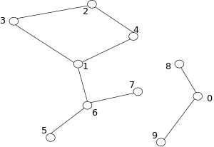

## Graph Processing using Apache Spark

The purpose of this project is to develop a graph analysis program using Apache Spark.

### Description

An undirected graph is represented in the input text file using one line per graph vertex. For example, the line

1,2,3,4,5,6,7
represents the vertex with ID 1, which is connected to the vertices with IDs 2, 3, 4, 5, 6, and 7. For example, the following graph: 




is represented in the input file as follows:

```java
3,2,1
2,4,3
1,3,4,6
5,6
6,5,7,1
0,8,9
4,2,1
8,0
9,0
7,6
```

Task is to write the Scala program that finds the connected components of any undirected graph and prints the size of these connected components. A connected component of a graph is a subgraph of the graph in which there is a path from any two vertices in the subgraph. For the above graph, there are two connected components: one 0,8,9 and another 1,2,3,4,5,6,7. Your program should print the sizes of these connected components: 3 and 7.

The following pseudo-code finds the connected components. It assigns a unique group number to each vertex (we are using the vertex ID as the group number), and for each graph edge between Vi and Vj, it changes the group number of these vertices to the minimum group number of Vi and Vj. That way, vertices connected together will eventually get the same minimum group number, which is the minimum vertex ID among all vertices in the connected component. 

### Compile & Running

Compile Graph.scala using:

```java
run graph.build
```

and you can run Graph.java in standalone mode over a small dataset using:

```java
sbatch graph.local.run
```

The results generated by your program will be in the directory output.

Run the program in distribited mode:

```java
sbatch graph.distr.run
```

This will process the graph on the large dataset large-graph.txt. This will work on the moderate-sized graph and will print the results to the output.


##### Pseudo-Code

The graph can be represented as RDD[ ( Long, Long, List[Long] ) ], where the first Long is the graph node ID, the second Long is the group that this vertex belongs to (initially, equal to the node ID), and the List[Long] is the adjacent list (the IDs of the neighbors). Here is the pseudo-code:

```java

// First create a class to represent a vertex:

var graph = /* read the graph from args(0); the group of a graph node is set to the node ID */

for (i <- 1 to 5)
   graph = graph.flatMap{ /* associate each adjacent neighbor with the node group number + the node itself with its group number*/ }
                .reduceByKey( /* get the min group of each node */ )
                .join( /* join with the original graph */ )
                .map{ /* reconstruct the graph topology */ }

/* finally, print the group sizes */

```
For example, for the node (20,6,List(22,23,24)), the flatMap must return the sequence Seq((20,6),(22,6),(23,6),(24,6)). The output (group sizes) must be sent to the output, not to a file.

Java main program, args[0] is the input graph, and write the output to the console.
